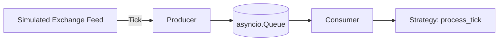
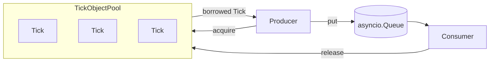
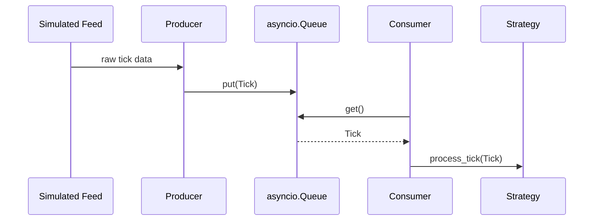
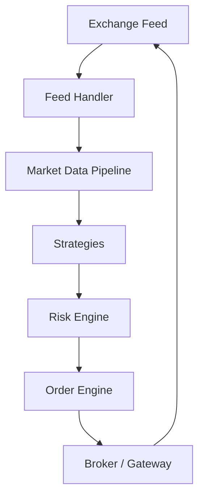

# 01 — Market Data Pipeline Engine

[](.github/workflows/ci.yml)
[](pyproject.toml)
[](LICENSE)
[](pyproject.toml)
[](pyproject.toml)

> Build a production-inspired market data ingestion pipeline from
> scratch, and learn how professional quantitative trading systems
> receive, process, distribute, and optimize millions of market
> events — while scaling from a single-user application to thousands
> of concurrent trading strategies.

<!-- PROJECT BANNER PLACEHOLDER — replace with screenshots/banner.png -->
<p align="center"><em>[ Project banner image placeholder — add screenshots/banner.png ]</em></p>

---

## Table of Contents

1. [Project Overview](#project-overview)
2. [Business Problem](#business-problem)
3. [Real World Example](#real-world-example)
4. [Why This Repository Exists](#why-this-repository-exists)
5. [Architecture](#architecture)
6. [Repository Structure](#repository-structure)
7. [Learning Roadmap](#learning-roadmap)
8. [How to Run](#how-to-run)
9. [Expected Output](#expected-output)
10. [Future Improvements](#future-improvements)

---

## Project Overview

This repository is a hands-on, documentation-first engineering project
that teaches how real trading platforms move price data from an
exchange to the strategies, risk engines, and dashboards that depend
on it — with **low latency** and **zero data loss**, at volumes that
can reach millions of events per second.

It is built as an open-source teaching artifact: every chapter of the
accompanying documentation explains the *business motivation* and
*problem* before showing any code, and every optimization is backed by
a profiling result and a benchmark, never intuition alone.

You will find, fully implemented and tested:

- A **naive** producer/consumer pipeline built on `asyncio.Queue`.
- Evidence, gathered via `cProfile` and `tracemalloc`, of exactly
  where that naive pipeline's time and memory go under load.
- An **optimized** pipeline using an **Object Pool** to eliminate the
  proven bottleneck.
- A full benchmark suite comparing both, with reproducible numbers.
- Unit, integration, and stress tests.
- Docker support, CI, and the full complement of open-source project
  hygiene files (CONTRIBUTING, CODE_OF_CONDUCT, ADRs, issue templates).

## Business Problem

Every trading strategy — from a retail investor's moving-average
crossover to an institutional quant fund's statistical arbitrage
model — depends on timely, accurate market data. Without it, a
strategy is blind, and a strategy acting on **stale** data can buy or
sell at a price that no longer exists.

- **Who generates market data?** Exchanges (NSE, NYSE, NASDAQ, CME,
  Binance) — every order placed, modified, cancelled, or matched
  produces an event.
- **Who consumes market data?** Trading strategies, risk engines,
  order routing systems, human traders via dashboards, and compliance
  systems.
- **Why do strategies depend on it?** A strategy is, fundamentally, a
  function of market data: `decision = f(price, history, order book)`.
  Late, lost, or duplicated data corrupts that function's input.

See [`docs/02_real_world_problem.md`](docs/02_real_world_problem.md)
for the full treatment.

## Real World Example

```
NSE
  ↓
Broker
  ↓
WebSocket
  ↓
Market Data Pipeline   <-- this repository
  ↓
Strategies
  ↓
Risk Engine
  ↓
Order Engine
  ↓
Broker
  ↓
Exchange
```

- **NSE**: A trade executes; a tick is born.
- **Broker**: Receives and re-broadcasts the exchange's raw feed.
- **WebSocket**: The transport layer carrying bytes to your systems.
- **Market Data Pipeline**: Decodes raw events into a usable
  structure and distributes them internally — this repository's focus.
- **Strategies**: React to the tick and may decide to trade.
- **Risk Engine**: Validates exposure/limits before any order is sent.
- **Order Engine**: Converts an approved decision into an order.
- **Broker → Exchange**: The order completes the loop.

This full round trip, in competitive environments, happens in
**microseconds to low milliseconds**. This repository focuses on the
one link in that chain most self-contained and most teachable: the
pipeline itself.

## Why This Repository Exists

Most tutorials either (a) show toy code with no connection to real
engineering tradeoffs, or (b) show production code with no explanation
of *why* it looks the way it does. This repository does neither. It:

- Starts with the business problem, not the code.
- Builds the simplest correct implementation first — no premature
  optimization.
- Profiles that implementation under real load to find an actual
  bottleneck.
- Fixes only that bottleneck, with a named, understood pattern
  (Object Pool), and proves the fix with benchmarks.
- Documents every tradeoff honestly, including the costs of each
  optimization — not just its benefits.

## Architecture

### Market Data Pipeline (core of this repository)



### Producer / Consumer with Object Pool (optimized version)



### Sequence Diagram



### Overall Trading Platform (for context — beyond this repo's scope)



Full diagrams, including scaling to thousands of consumers and a
deployment diagram, are in
[`docs/08_scaling.md`](docs/08_scaling.md) and
[`docs/09_future_architecture.md`](docs/09_future_architecture.md).

## Repository Structure

```
market-data-pipeline-engine/
├── README.md
├── LICENSE
├── CHANGELOG.md
├── CONTRIBUTING.md
├── CODE_OF_CONDUCT.md
├── requirements.txt
├── pyproject.toml
├── .gitignore
├── Dockerfile
├── docker-compose.yml
├── docs/
│   ├── 01_introduction.md
│   ├── 02_real_world_problem.md
│   ├── 03_market_data_flow.md
│   ├── 04_building_pipeline.md
│   ├── 05_performance_problem.md
│   ├── 06_object_pool.md
│   ├── 07_benchmark.md
│   ├── 08_scaling.md
│   ├── 09_future_architecture.md
│   ├── glossary.md
│   └── adr/
│       ├── 0001-use-asyncio.md
│       └── 0002-object-pool.md
├── market_pipeline/
│   ├── __init__.py
│   ├── models.py
│   ├── generator.py
│   ├── consumer.py
│   ├── metrics.py
│   ├── logging_config.py
│   ├── object_pool.py
│   ├── pipeline_naive.py
│   └── pipeline_optimized.py
├── tests/
│   ├── test_models.py
│   ├── test_object_pool.py
│   ├── test_pipeline_naive.py
│   ├── test_pipeline_optimized.py
│   ├── test_integration.py
│   └── test_stress.py
├── benchmarks/
│   ├── benchmark_naive.py
│   ├── benchmark_optimized.py
│   ├── compare.py
│   └── results/
├── examples/
│   ├── run_naive_example.py
│   └── run_optimized_example.py
├── screenshots/
└── .github/
    ├── workflows/ci.yml
    ├── ISSUE_TEMPLATE/
    └── PULL_REQUEST_TEMPLATE.md
```

## Learning Roadmap

| Chapter | Topic | What You'll Learn |
|---|---|---|
| [01](docs/01_introduction.md) | Introduction | The business question this repo answers, and the learning path |
| [02](docs/02_real_world_problem.md) | Real World Problem | Who generates/consumes market data, and why speed matters |
| [03](docs/03_market_data_flow.md) | Market Data Flow | Producer/consumer/queue as a foundational pattern |
| [04](docs/04_building_pipeline.md) | Building the Pipeline | A correct, simple, unoptimized implementation |
| [05](docs/05_performance_problem.md) | Performance Problem | Using `cProfile` and `tracemalloc` to find a real bottleneck |
| [06](docs/06_object_pool.md) | Object Pool | Fixing the proven bottleneck, and its honest tradeoffs |
| [07](docs/07_benchmark.md) | Benchmarking | Proving the fix works, with reproducible numbers |
| [08](docs/08_scaling.md) | Scaling | Broadcasting to thousands of consumers, conceptually |
| [09](docs/09_future_architecture.md) | Future Architecture | Where this pipeline fits in a full trading platform |
| [Glossary](docs/glossary.md) | — | Every technical term, explained in plain English |

## How to Run

### Local (Python 3.12+)

```bash
git clone https://github.com/<your-username>/market-data-pipeline-engine.git
cd market-data-pipeline-engine
python -m venv .venv && source .venv/bin/activate   # Windows: .venv\Scripts\activate
pip install -e ".[dev,charts]"

# Run the simplest examples
python examples/run_naive_example.py
python examples/run_optimized_example.py

# Run the full benchmark comparison
python benchmarks/compare.py 1000000 1000

# Run tests
pytest -m "not stress"    # fast suite
pytest                    # full suite, including stress tests

# Lint / type-check
ruff check .
black --check .
mypy market_pipeline
```

### Docker

```bash
docker compose up --build
```

This runs `benchmarks/compare.py` with a default workload inside a
reproducible container and writes any generated chart to
`benchmarks/results/`.

## Expected Output

The output below is real output from `python benchmarks/compare.py 1000000 1000`,
run on the CI/development container used to build this repository (a
shared, virtualized CPU — not tuned hardware):

```
Running comparison with 1,000,000 ticks (pool_size=1000)...

Metric                           Naive       Optimized
------------------------------------------------------
Ticks Processed                1000000         1000000
Objects Created                1000000            1001
Objects Reused                       0          999999
Peak Queue Size                1000000            1000
Elapsed Time (s)                20.416          12.974
Throughput (ticks/s)            48,980          77,076
Peak Memory (MB)                148.67            0.09

Speedup: 1.57x
```

The key result to notice is not the raw throughput (which is heavily
dependent on the underlying hardware) but the **shape** of the
improvement: `Objects Created` drops from 1,000,000 to ~1,000, and
`Peak Memory` drops by over 1,600x, because the optimized pipeline is
no longer allocating and discarding a new object per tick. Throughput
improves as a downstream effect of that reduced allocation and GC
pressure.

Exact numbers will vary by machine (CPU, OS scheduler, Python build) —
run it yourself, and see [`docs/07_benchmark.md`](docs/07_benchmark.md)
for how to interpret relative differences instead of chasing absolute
figures.

## Future Improvements

- Multi-consumer fan-out (pub/sub) implementation, building on the
  conceptual design in [`docs/08_scaling.md`](docs/08_scaling.md).
- A second, real (rate-limited, sandboxed) exchange connector as an
  optional example, alongside the simulator.
- A lock-free ring buffer variant for comparison against the
  `asyncio.Queue`-based design.
- Multi-process sharding by symbol, with shared-memory Tick
  distribution.
- Structured error handling and dead-letter queues in the consumer
  path.

---

## Contributing

Contributions are welcome — see [CONTRIBUTING.md](CONTRIBUTING.md) for
setup instructions and our engineering standards (explain WHY before
HOW, profile before optimizing, keep files under ~200 lines). Please
also review our [Code of Conduct](CODE_OF_CONDUCT.md).

## License

Distributed under the MIT License. See [LICENSE](LICENSE) for details.
