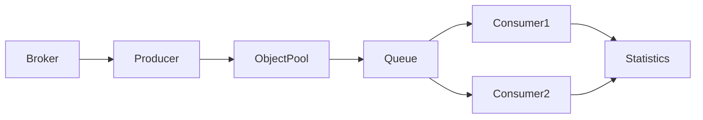

# 🚀 Market Data Pipeline Engine

> A production-inspired Python implementation of a scalable market data ingestion pipeline demonstrating asynchronous processing, object pooling, and memory-efficient architecture used in quantitative trading systems.

---

## Why This Repository Exists

Most algorithmic trading tutorials focus on **building strategies**.

Very few explain what happens **before a strategy receives market data.**

In real trading platforms, millions of market events arrive every second.

Before a trading strategy can react, those events must be:

- Received
- Parsed
- Stored
- Routed
- Processed

If the ingestion pipeline cannot keep up, the entire trading platform becomes slower regardless of how good the strategy is.

This repository demonstrates how professional systems solve this problem.

---

# The Engineering Problem

Suppose a broker sends

```
2,000,000 market ticks
```

Every incoming tick becomes a Python object.

Naive implementation:

```
Tick

↓

Create Dictionary

↓

Push Queue

↓

Process

↓

Destroy Object
```

Repeat this millions of times.

Eventually:

- CPU usage increases
- Memory usage grows
- Garbage Collector pauses appear
- Throughput decreases
- Latency becomes unpredictable

The bottleneck isn't network speed.

The bottleneck is continuous memory allocation.

---

# Repository Goal

Build a clean, modular market data ingestion pipeline while introducing the engineering concepts used in high-performance trading infrastructure.

The project gradually evolves from a simple implementation into a production-inspired architecture.

---

# Architecture



---

# Learning Roadmap

| Step | Topic |
|------|---------|
| 1 | Async Market Data Producer |
| 2 | Producer-Consumer Pattern |
| 3 | Object Pool |
| 4 | Queue Backpressure |
| 5 | Statistics Collection |
| 6 | Benchmarking |
| 7 | Performance Optimization |

---

# Repository Structure

```
market_pipeline/
```

Contains the production code.

```
docs/
```

Detailed engineering explanations.

```
benchmarks/
```

Performance comparison scripts.

```
tests/
```

Unit tests.

```
examples/
```

Simple runnable examples.

---

# What You'll Learn

✔ AsyncIO

✔ Producer Consumer Pattern

✔ Object Pool

✔ Memory Reuse

✔ Garbage Collection Reduction

✔ Queue Backpressure

✔ Performance Benchmarking

✔ Clean Software Architecture

✔ Production Code Organization

---

# Expected Output

```
------------------------------------

Market Data Pipeline

------------------------------------

Ticks Generated:

1,000,000

Ticks Processed:

1,000,000

Objects Allocated:

100

Objects Reused:

999,900

Peak Queue Size:

132

Elapsed Time:

1.18 sec

Throughput:

847,000 ticks/sec

------------------------------------
```

---

# Technologies

- Python 3.12
- asyncio
- dataclasses
- typing
- pytest
- matplotlib

---

# Future Improvements

- Shared Memory
- Lock-Free Ring Buffer
- Zero-Copy Serialization
- SIMD Processing
- Memory Mapping
- Kafka Integration
- Redis Streams
- Arrow IPC

---
