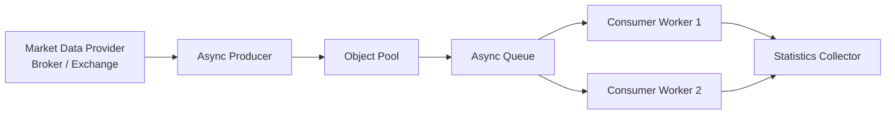
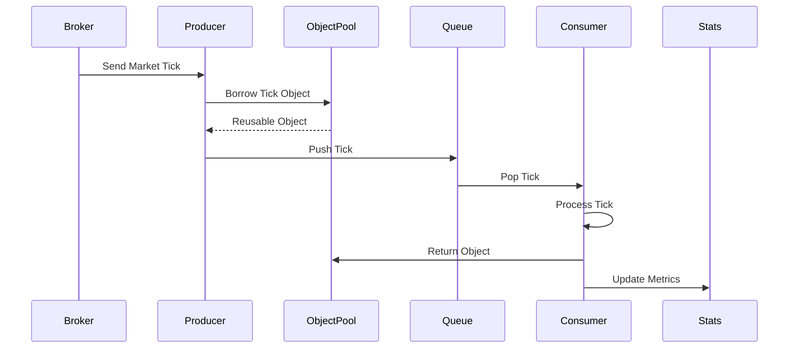

# System Architecture

## Overview

This repository demonstrates a simplified version of a **high-performance market data ingestion pipeline** commonly found in algorithmic trading platforms.

The objective is to efficiently receive, buffer, process, and recycle market data events while minimizing memory allocations and maintaining predictable latency.

---

# High-Level Architecture



---

# Data Flow

```
Market Feed
      │
      ▼
Receive Tick
      │
      ▼
Borrow Tick Object
      │
      ▼
Populate Tick Data
      │
      ▼
Async Queue
      │
      ▼
Consumer Workers
      │
      ▼
Business Processing
      │
      ▼
Return Object to Pool
      │
      ▼
Statistics Collection
```

---

# Component Responsibilities

## 1. Market Data Provider

Simulates a real-world broker or exchange.

Examples include:

- Zerodha Kite
- Binance
- Interactive Brokers
- Polygon.io
- Alpha Vantage

Its responsibility is to continuously publish market ticks.

Example Tick

```text
AAPL
Price : 194.35
Volume : 145
Timestamp : 12:30:21.123456
```

---

## 2. Async Producer

The Producer continuously receives incoming market events.

Responsibilities

- Receive market ticks
- Borrow reusable objects from the Object Pool
- Populate the object
- Push it into the processing queue

The Producer never performs heavy calculations.

---

## 3. Object Pool

The Object Pool maintains a fixed number of reusable Tick objects.

Instead of creating:

```
Tick()
Tick()
Tick()
Tick()
Tick()
```

it reuses existing objects.

Benefits

- Reduced allocations
- Lower Garbage Collection
- Better CPU cache locality
- Predictable latency

---

## 4. Async Queue

The queue decouples producers from consumers.

```
Producer

↓

Queue

↓

Consumers
```

This allows temporary traffic spikes without blocking the producer.

---

## 5. Consumer Workers

Consumers process incoming market ticks.

Typical production work includes

- Validation
- Feature calculation
- Indicator updates
- Strategy execution
- Risk checks

After processing is complete, the Tick object is returned to the Object Pool.

---

## 6. Statistics Collector

Collects runtime metrics such as

- Total ticks processed
- Throughput
- Queue depth
- Objects allocated
- Objects reused
- Processing latency

These metrics help evaluate system performance.

---

# Complete Pipeline



---

# Why This Architecture?

A naïve implementation creates a new Python object for every market event.

```
Tick()

↓

Queue

↓

Destroy
```

Repeated millions of times, this causes

- Frequent memory allocation
- Garbage collection pauses
- Increased CPU utilization
- Poor cache locality

The architecture demonstrated here minimizes these issues by reusing objects and separating ingestion from processing.

---

# Scalability

This design can be extended to support:

- Multiple producers
- Multiple consumer workers
- Shared memory
- Lock-free ring buffers
- Zero-copy serialization
- Distributed message brokers (Kafka, Redis Streams)
- Multi-tenant strategy execution

The current implementation focuses on the foundational concepts required before introducing these advanced optimizations.


#updated by kuldip