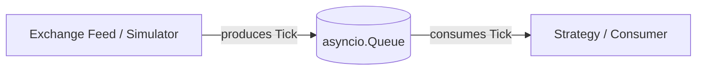
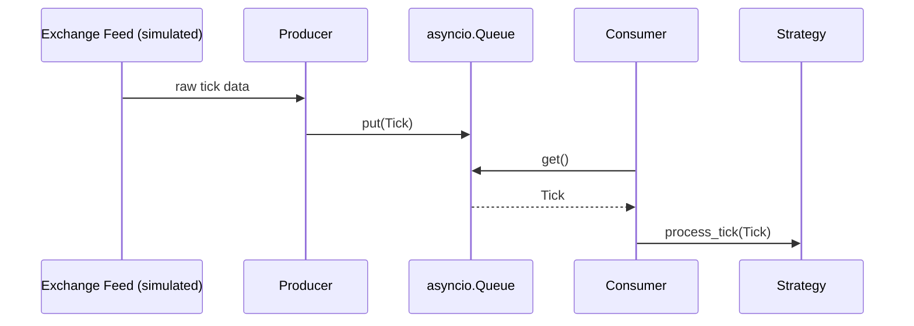

# Chapter 3 — Market Data Flow

## Business Motivation

Before writing code, we need a shared mental model of how data flows
*inside* the pipeline itself -- not just the high-level chain from
Chapter 2, but the internal producer → queue → consumer pattern that
almost every data pipeline, in any domain, is built from.

## Problem

We have a continuous, high-frequency stream of ticks arriving from
"the outside" (an exchange feed, or in our case, a simulation). We
need to get each tick to internal consumers (strategies) without:

- Blocking the part of the system that's receiving new data while a
  slow consumer is still working on an old tick.
- Losing ticks if a consumer momentarily falls behind.
- Coupling the producer's code directly to every consumer's code
  (tight coupling makes the system impossible to extend).

## Naive (Mental) Solution

The simplest thing you could imagine: a single loop that receives a
tick and immediately calls the strategy function directly.

```python
for tick in feed:
    strategy.on_tick(tick)   # tight coupling, no decoupling at all
```

## Why It Fails

- If `strategy.on_tick` is slow (even briefly -- a network call, a
  disk write, a lock), the entire feed-reading loop stalls with it.
  In a real system this can mean *missing* incoming exchange data
  entirely while your code is busy.
- Adding a second strategy means editing the loop itself. This does
  not scale to "thousands of concurrent trading strategies," which is
  the explicit goal stated in this repository's business question.

## Production Solution: Producer / Consumer with a Queue

We decouple "receiving data" from "acting on data" using a **queue**
(see glossary) as the hand-off point:



- The **producer** only has one job: get data off the wire (or, in our
  simulation, generate it) and push it onto the queue as fast as
  possible.
- The **consumer** only has one job: pull data off the queue and
  process it.
- Neither needs to know anything about the other's internals -- they
  only share the queue's interface (`put` / `get`).

This is exactly the shape of `pipeline_naive.py`, built in Chapter 4.

## Sequence Diagram



## Engineering Tradeoffs

- A queue decouples producer and consumer speed, but does **not**
  eliminate the problem of a consumer being permanently too slow --
  it just gives that problem a visible symptom (a growing queue),
  instead of an invisible one (a stalled feed reader). We deliberately
  leave the queue **unbounded** in Chapter 4 so we can *observe* this
  symptom before fixing anything -- see Chapter 5.
- This pattern generalizes: swap "strategy" for "risk engine" or
  "logger" and the same producer/queue/consumer shape applies. Chapter
  8 (Scaling) revisits this when we go from one consumer to many.

## Code

No new code in this chapter -- we're building the mental model first.
The implementation appears in `market_pipeline/pipeline_naive.py`,
covered in Chapter 4.

---

## What We Learned

- Producer/consumer decoupling via a queue is the foundational pattern
  for nearly every data pipeline, not just trading systems.
- An unbounded queue doesn't prevent slow consumers -- it just makes
  the problem observable (queue growth) instead of catastrophic (a
  stalled producer).

## Key Takeaways

- Decoupling ≠ solving every problem. It converts one problem
  (blocking) into a different, more manageable one (queue growth).
- `asyncio.Queue` is a task-safe hand-off point between coroutines
  running on the same event loop.

## Interview Questions

1. What is backpressure, and why might an unbounded queue be
   dangerous in production even though it's simple?
2. Why is decoupling producer and consumer speed valuable even if you
   never expect the consumer to be slow?

## Real Production Notes

Production market data pipelines often use dedicated messaging
infrastructure (Kafka, Aeron, ZeroMQ, or custom shared-memory ring
buffers) instead of `asyncio.Queue`, precisely because they need
bounded memory, multi-consumer fan-out, and cross-process (not just
cross-coroutine) communication. We start with `asyncio.Queue` because
it teaches the *pattern* without the operational overhead of running
external infrastructure -- see Chapter 9 for how this evolves.

## Common Beginner Mistakes

- Confusing "the queue is a fix" with "the queue reveals the problem."
- Forgetting that an unbounded queue can grow to consume all available
  memory if a consumer is permanently slower than the producer.

## Exercises

1. Draw your own sequence diagram showing what happens if the
   `Consumer` in the diagram above becomes 10x slower halfway through
   the run.
2. Name one real-world queueing system (post office, restaurant
   kitchen, call center) and map its "producer," "queue," and
   "consumer" roles.
