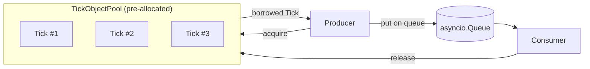

# Chapter 6 — The Object Pool Optimization

## Business Motivation

Chapter 5 gave us evidence, not just suspicion: at high tick volumes,
allocating a brand-new `Tick` object for every event contributes
measurable overhead. In a business where microseconds can determine
whether a strategy captures a price or misses it, this overhead is
worth eliminating -- but only because we've proven it's real.

## Problem

We need to process the same number of ticks with **fewer memory
allocations**, without changing the external behavior of the pipeline
(same input → same output, same correctness guarantees).

## Naive Solution (What We Already Have)

```python
tick = Tick(symbol, price, quantity, timestamp_ns)
# ... use tick ...
# tick becomes garbage as soon as it goes out of scope
```

Every tick's memory is allocated fresh and then discarded almost
immediately -- exactly the pattern Chapter 5 identified as costly at
scale.

## Why It Fails at Scale

Python's memory allocator and garbage collector are general-purpose
and must safely handle allocations of every shape and size, from tiny
integers to huge data structures. That generality has a cost. When one
specific object shape (`Tick`) is created and destroyed millions of
times per second in a tight loop, we can do meaningfully better than
the general-purpose allocator by **recognizing the pattern ourselves**
and recycling memory directly.

## Production Solution: Object Pool

An **Object Pool** (see glossary) pre-allocates a fixed number of
`Tick` objects once, up front. Instead of `Tick(...)` creating new
memory each time, we **borrow** an existing object from the pool,
overwrite its fields (`tick.reset(...)`), use it, and then **return**
it to the pool for the next borrower.



### Key Implementation Detail: `reset()`, Not `__init__()`

Look at `market_pipeline/models.py` -- the `Tick.reset()` method
overwrites fields on an *existing* object rather than constructing a
new one. This is the mechanism that makes pooling possible: the pool
hands back an old object, and `reset()` gives it new data without a
fresh allocation.

### The Pool Itself

See `market_pipeline/object_pool.py`, `TickObjectPool`:

- `acquire(...)` returns a recycled Tick if one is available, or falls
  back to a real allocation if the pool is exhausted (correctness
  first -- performance second).
- `release(tick)` returns a Tick to the pool once a consumer is done
  with it.

## Engineering Tradeoffs (Be Honest)

This optimization is not free:

1. **Discipline required.** Every `acquire()` must be matched with a
   `release()`, or the pool silently degrades back into "always
   allocate new" (a leak of pooled capacity, not memory itself, since
   Python's GC will still eventually collect unreturned objects).
2. **Aliasing danger.** Because pooled `Tick` objects are *mutated and
   reused*, code must never hold a reference to a Tick after releasing
   it -- the next consumer's data may already be sitting in that same
   object. This is exactly the kind of bug that's easy to introduce
   and hard to debug, which is why we call it out explicitly here.
3. **Added complexity for a specific, proven problem.** If Chapter 5
   had NOT shown allocation overhead as a real bottleneck, none of
   this complexity would be justified. Pooling is a targeted fix for a
   measured problem, not a default pattern to apply everywhere.

## Code

Full implementation: `market_pipeline/object_pool.py`,
`market_pipeline/pipeline_optimized.py`. Compare the optimized
pipeline directly against `pipeline_naive.py` -- the only structural
difference is `pool.acquire()` / `pool.release()` in place of
`Tick(...)`.

---

## What We Learned

- Object pooling trades a small amount of code complexity for reduced
  allocation and GC overhead at high throughput.
- Mutating and reusing objects introduces an aliasing hazard that must
  be handled through discipline (never read a released object).

## Key Takeaways

- Pools are a targeted fix for allocation-heavy hot paths -- not a
  general-purpose performance pattern to sprinkle everywhere.
- `reset()`-in-place is the mechanism; `acquire`/`release` is the
  contract.

## Real Production Notes

Object pools are common in game engines, network servers, and trading
systems alike -- anywhere a fixed-shape object is created and
destroyed at very high frequency. Some production systems go further
with **slab allocators** or custom memory arenas in lower-level
languages (C++, Rust) for even tighter control, but the core idea --
reuse instead of reallocate -- is identical.

## Common Beginner Mistakes

- Forgetting to call `release()`, silently losing the benefit of
  pooling over time.
- Sizing the pool arbitrarily without measuring actual peak concurrent
  usage (Chapter 7 shows how to reason about pool sizing empirically).
- Reading a `Tick`'s fields after releasing it back to the pool.
