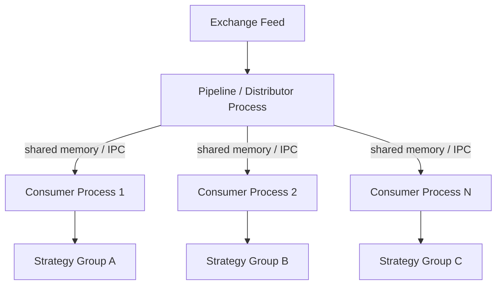

# Chapter 8 — Scaling to Thousands of Consumers

## Business Motivation

Our pipeline so far has exactly one consumer. Real trading platforms
support **thousands of concurrent strategies**, each independently
interested in some or all of the tick stream. This chapter addresses
that gap conceptually and shows the direction the codebase would grow
in, without over-building infrastructure a teaching repository doesn't
need to actually run.

## Problem

If we naively add more consumers to our existing single `asyncio.Queue`
design, we hit an immediate correctness issue: `asyncio.Queue.get()`
removes an item once any one consumer takes it. Two consumers
competing on the same queue would **split** the tick stream between
them (each tick delivered to only one), not **broadcast** it to both.
For independent trading strategies, we need every interested consumer
to see every tick -- broadcast, not competition.

## Naive Solution

Give every consumer its own queue, and have the producer put every
tick onto every queue:

```python
for queue in all_consumer_queues:
    await queue.put(tick)
```

## Why It (Eventually) Fails

This works correctly for a small number of consumers, but:

- The producer's put-loop cost grows linearly with the number of
  consumers -- 1,000 consumers means 1,000 `put()` calls per tick.
- Every consumer queue duplicates the tick data (unless we're careful
  to share, not copy, tick objects -- our object pool's mutation model
  actually makes this *harder* to do safely across many independent
  consumers, since one consumer's `release()` could invalidate a Tick
  another consumer hasn't finished reading yet).
- All of this still runs on a single OS thread/process, bound by
  Python's Global Interpreter Lock (GIL) for any CPU-bound consumer
  work -- eventually, CPU-bound strategies would need to run in
  separate processes to truly parallelize.

## Production Direction: Fan-Out and Sharding

Real systems address this with a combination of approaches:



- **Fan-out via pub/sub**: A dedicated distribution layer (e.g. a
  message broker, or a custom multicast/shared-memory ring buffer)
  publishes each tick once; every subscriber reads independently
  without the producer needing per-consumer logic.
- **Sharding by symbol**: Not every strategy needs every instrument.
  Splitting the universe by symbol across multiple pipeline instances
  reduces the fan-out problem's blast radius.
- **Immutable snapshots instead of mutable pooled objects** for
  cross-process or cross-consumer-group distribution -- our object
  pool's mutate-in-place design (Chapter 6) is a great fit for a
  single-process, single-consumer-group hot path, but a poor fit once
  ticks must be safely shared across independent, uncoordinated
  readers. Production systems typically pool objects *within* a
  distribution stage, then serialize an immutable copy for fan-out.
- **Separate OS processes** for CPU-bound strategy logic, sidestepping
  the GIL, communicating via shared memory or a broker rather than
  in-process `asyncio.Queue`.

## Engineering Tradeoffs

- Multi-consumer fan-out with immutable copies trades some of the
  allocation-efficiency win from Chapter 6 for correctness and
  isolation across independent consumers. This is a genuine tradeoff,
  not a free upgrade -- it's why we don't simply "always" pool
  everything, everywhere.
- Sharding by symbol adds operational complexity (routing, rebalancing)
  in exchange for horizontal scalability.

## Code

This chapter is intentionally conceptual. Implementing a full
multi-process, shared-memory fan-out system is outside the scope of
this repository (see `docs/09_future_architecture.md` for what such a
system would look like at a higher level). The single-process,
single-consumer-group pipeline built in Chapters 4-7 remains the
concrete, runnable artifact this repository ships.

---

## What We Learned

- Broadcasting to many independent consumers is a fundamentally
  different problem than serving a single consumer, and naive
  extensions of a single-consumer design don't scale cleanly.
- Object pooling and safe multi-consumer fan-out are in tension --
  each stage of a real system chooses the right tradeoff for its own
  concurrency model.

## Key Takeaways

- "Scale" isn't one problem -- it decomposes into throughput scaling
  (Chapters 5-7) and fan-out/consumer-count scaling (this chapter).
- Sharding and pub/sub are the standard production answers to
  consumer-count scaling.

## Interview Questions

1. Why can't you simply share one mutable, pooled `Tick` object across
   many independent, uncoordinated consumers?
2. What's the tradeoff between sharding market data by symbol vs.
   broadcasting the full universe to every consumer?

## Real Production Notes

Firms with genuinely massive fan-out requirements often build custom
kernel-bypass networking and shared-memory ring buffers (e.g. using
technologies inspired by the LMAX Disruptor pattern) specifically to
avoid the serialization and copying costs of conventional message
brokers at these volumes.

## Common Beginner Mistakes

- Assuming you can simply "add more consumers" to an existing
  single-queue design and get correct broadcast behavior for free.
- Forgetting that mutable, pooled objects are unsafe to share across
  consumers that don't coordinate their read/release timing.

## Exercises

1. Sketch a design (diagram + pseudocode) for broadcasting ticks to
   exactly 3 consumers using 3 separate `asyncio.Queue` instances fed
   by one producer loop.
2. Research one real message broker (Kafka, NATS, or ZeroMQ) and
   identify which of the tradeoffs discussed in this chapter it makes
   for you automatically, and which it leaves to you.
