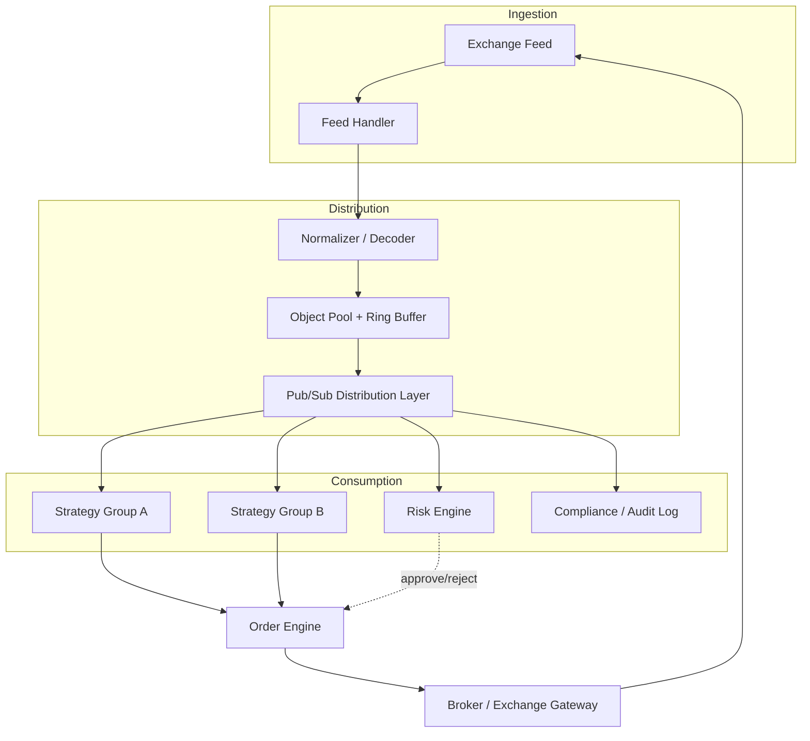
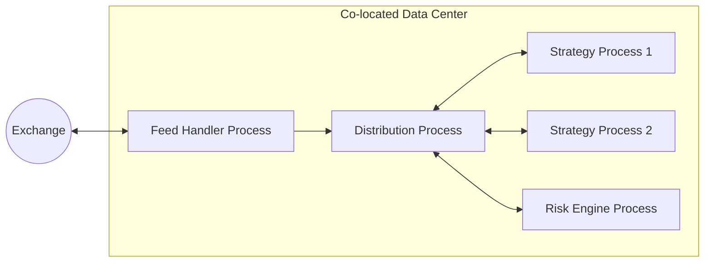

# Chapter 9 — Toward a Production Architecture

## Business Motivation

This repository has taken you from "a single Python process handling
one producer and one consumer" to a benchmarked, object-pool-optimized
pipeline, with a conceptual path toward multi-consumer fan-out. This
final chapter zooms out and describes, at an architectural level, what
a real production market data platform looks like -- so you can place
everything you've built into the bigger picture.

## The Full Picture

## Deployment Diagram

## What This Repository Built vs. What's Beyond Scope

| Layer                         | This Repository                          | Real Production System                                  |
|-------------------------------|-------------------------------------------|-----------------------------------------------------------|
| Feed ingestion                 | Simulated generator                       | Binary protocol parsers (ITCH, FIX, proprietary)          |
| Internal transport              | `asyncio.Queue`, single process           | Shared memory ring buffers / message brokers, multi-process |
| Object lifecycle                 | `TickObjectPool` (Chapter 6)              | Same idea, often extended with slab allocators             |
| Fan-out to many consumers         | Discussed conceptually (Chapter 8)        | Pub/sub, sharding by symbol, kernel-bypass networking       |
| Risk / order routing               | Out of scope                              | Dedicated, independently-tested systems with strict SLAs   |
| Deployment                          | Docker / docker-compose                   | Co-located bare-metal or specialized cloud regions          |

## Why We Stopped Where We Stopped

Every layer we did NOT build (feed protocol parsing, distributed
messaging, risk/order engines) is itself a multi-month-or-year
engineering effort at a real firm, with its own correctness and
regulatory requirements. Building a full trading platform is not the
goal of this repository -- **understanding the core engineering
reasoning behind a market data pipeline, from naive implementation to
measured optimization, is.** That reasoning transfers directly to
those other layers, even though we didn't build them here.

## Engineering Tradeoffs, Revisited

Looking back across the whole repository, every decision we made was a
tradeoff, made consciously and explained before it was applied:

- `asyncio.Queue` over raw sockets/threads: simplicity over raw
  performance, appropriate for the workload and audience.
- Object pooling over "just allocate": proven allocation overhead,
  traded for added complexity and an aliasing hazard.
- Single-process design over distributed fan-out: scope control for a
  teaching repository, with the production direction discussed rather
  than half-implemented.

## Code

No new code -- this chapter is a map of where the code you've already
built fits into a larger system, and what would need to be added to
go further.

---

## What We Learned

- A production market data platform is a composition of many
  specialized subsystems, each with its own engineering tradeoffs.
- The reasoning process demonstrated in this repository (measure,
  don't guess; optimize only proven bottlenecks) applies at every
  layer of that larger system, not just the one we built.

## Key Takeaways

- Scope control is itself an engineering decision -- knowing what NOT
  to build is as important as knowing what to build.
- Everything in this repository is a faithful, simplified slice of a
  much larger real-world system, not a toy disconnected from it.

## Interview Questions

1. If you were asked to add a Risk Engine to this pipeline, where in
   the architecture diagram would you place it, and why there?
2. What would change about our object pool design if ticks needed to
   be shared across process boundaries instead of staying within one
   process?

## Real Production Notes

Some real trading platforms process the full data-to-order round trip
in **single-digit microseconds** for the hottest paths, achieved
through techniques (kernel bypass, FPGA acceleration, hand-tuned
memory layouts) that go well beyond what pure Python can achieve --
Python is much more commonly used for strategy research, monitoring,
and less latency-critical paths, with hot paths written in C++, Rust,
or specialized hardware.

## Common Beginner Mistakes

- Believing a single technology choice (e.g. "just use Kafka") solves
  every scaling problem without understanding the tradeoffs it
  introduces.
- Assuming production systems are built all at once, rather than
  evolving incrementally the same way this repository did, chapter by
  chapter.

## Exercises

1. Draw your own version of the "Full Picture" diagram, adding a
   component for handling exchange feed disconnects/reconnects.
2. Pick one row from the "This Repository vs. Real Production System"
   table and research one real open-source project that implements
   that production-grade version.
